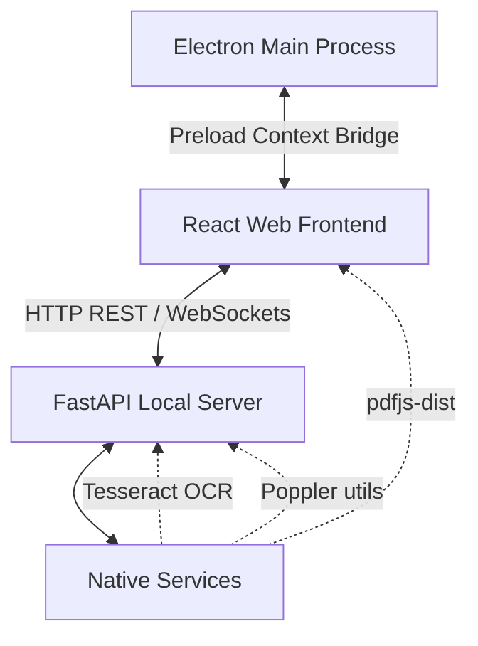

# ClearSight Docs — System Architecture & Design Boundaries

This document serves as the canonical source of architectural boundaries, data flows, native integrations, and operational rules for the ClearSight Docs desktop application. It ensures performance-critical design decisions are preserved across future feature additions and AI agent refactoring cycles.

---

## 1. System Topology Overview

ClearSight Docs is designed as a hybrid desktop application combining a rich, modern web frontend with a fast, specialized document manipulation backend:



- **Frontend Wrapper**: Electron hosts a React/TypeScript application running inside a sandboxed chromium shell.
- **Backend Application Server**: A local Python subprocess running a FastAPI web server handles high-throughput document processing.
- **System Communications**:
  - Native OS features (file dialogue, port detection, custom title bars) communicate via Electron IPC.
  - Document conversion and OCR data streams travel over standard HTTP endpoints and real-time WebSockets to the localhost FastAPI server.

---

## 2. Performance Boundary: The Dual-Ingest Strategy

To solve a severe performance bottleneck common in hybrid wrapper apps, ClearSight Docs employs a **Dual-Ingest Strategy** for document files.

### The Bottleneck
Serializing large multi-gigabyte PDF files or image streams into HTTP multipart forms to send over `localhost` incurs a heavy serialization penalty, high V8 heap overhead, memory duplication, and high CPU usage that can temporarily freeze the desktop UI.

### The Optimization: Absolute Path Bypass
Since both the frontend and backend run on the exact same host system, the Electron main process extracts the absolute file paths of the selected files on the user's hard drive and sends them directly to the frontend.
The frontend then bypasses standard HTTP uploads by simply sending the **absolute string paths** to the backend using form-data fields named `file_path` (single file) or `files_path` (multiple files).
The backend's centralized dependency injections resolve and validate these local paths directly:

```python
# FastAPI dependencies defined inside backend/api.py
async def resolve_single_input(file: UploadFile | None = File(None), file_path: str | None = Form(None)) -> tuple[Path, Path]:
async def resolve_multiple_inputs(files: list[UploadFile] | None = File(None), files_path: list[str] | None = Form(None)) -> tuple[list[Path], Path]:
```

### Path Sanitization
To prevent malicious local traversal attempts, both dependency functions execute strict path validations before returning the files:
- Rejects any paths containing directory traversal segments (e.g. `..`).
- Fully resolves the path via `Path.resolve(strict=True)` to confirm absolute path integrity.
- Asserts that the path matches an active file on disk via `Path.is_file()`.

### The Fallback
Standard `UploadFile` (multipart file uploads) is fully preserved in the backend dependency resolution to maintain API completeness and support standard HTTP clients (e.g., standard browser tests or external integration triggers).

> [!WARNING]
> **CRITICAL DEVELOPER RULE**: Do not remove the `file_path` / `files_path` local path bypass logic, and do not revert the desktop client to standard HTTP UploadFile patterns. This bypass is essential for high-performance desktop execution on large files.

---

## 3. Native Bindings & External Dependencies

### Electron IPC contextBridge (`window.electronAPI`)
Electron exposes a safe native bridge to the frontend inside `preload.ts`:
- `openFiles(options)`: Opens a native system file selector window and returns details of the picked documents, including their absolute path strings.
- `readFile(filePath)`: Reads raw files from the native filesystem into an `ArrayBuffer` for processing by frontend libraries (e.g. rendering thumbnails).
- `getPort()`: Retrieves the dynamically assigned local port where the FastAPI subprocess is listening.
- `titlebar`: Handles system window actions (minimize, maximize, close) from our custom-styled Title Bar component.

### Native Binary Dependencies
The backend requires native system tools to carry out heavy conversions, dynamically resolved through wrapper services:
1. **Tesseract OCR Engine**: Used for Optical Character Recognition inside `OCRService`. Requires the system binary `tesseract` to be available in the local PATH environment.
2. **Poppler Utilities**: Used for converting PDFs to high-quality images via `pdf2image` in `PdfToImagesService`. Resolved dynamically through a custom `_poppler.py` utility that inspects the local directory hierarchy and standard system install paths to locate the `pdftoppm` binary.

---

## 4. Operational Rules for AI Agents

When modifying this repository, all AI agents must strictly adhere to the following directives to prevent regressions, runtime file locks, or layout breakdowns:

### 1. Token Conservation
- Do not output entire codebase files or large components unless explicitly asked by the user. Prefer targeted patches, modular file overrides, or specific replace blocks.

### 2. Version Control Limits
- Do **not** run Git commands to auto-commit modifications or stage changes. Leave all workspace commits to the human operator.

### 3. Backend File Cleanup Pattern
- Every new document processing endpoint added to `backend/api.py` must use the custom `CleanupFileResponse` pattern within a structured `try...except` wrapper.
- **Do not** utilize standard FastAPI `BackgroundTasks` for temporary working directory teardown. Using `CleanupFileResponse` ensures the temporary folder is deleted **only after** the binary stream is fully flushed to the client, preventing OS file-lock race conditions.
  ```python
  try:
      # ... logic and file generation ...
      return CleanupFileResponse(
          path=output_path,
          media_type="application/pdf",
          filename="output.pdf",
          temp_dir=tmp_dir
      )
  except Exception as e:
      _cleanup_dir(tmp_dir)
      raise HTTPException(status_code=500, detail=str(e))
  ```

### 4. Frontend Layout Guidelines
- The main desktop panel layout uses a **full-bleed vertical flexbox layout** (`w-full h-full flex flex-col overflow-hidden`).
- Sidebars and workspace views must rely on internal scroll handles (`flex-1 overflow-y-auto custom-scrollbar`) on container children, rather than expanding parent nodes or triggering global document viewport scroll bars.
